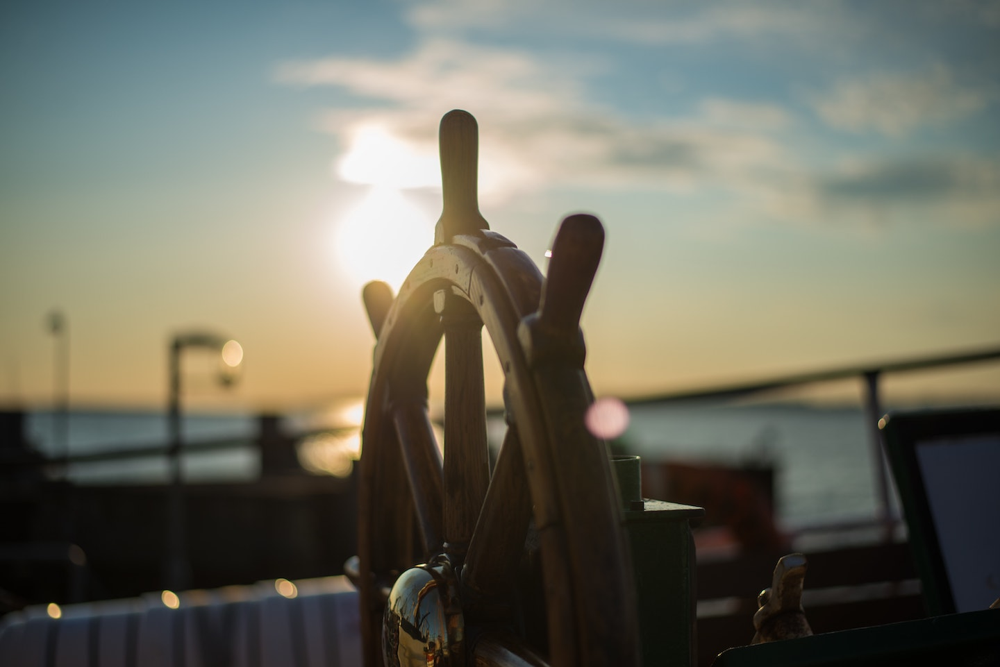

# Introduction to #66DaysOfK8s

Photo by [Maximilian Weisbecker](https://unsplash.com/@maxweisbecker) on [Unsplash](https://unsplash.com/photos/Esq0ovRY-Zs).

---

## TL;DR

Do learn daily until you reach 66, without a miss. Then you probably will create a new habit.

In my case, I wanted to improve my skills in Kubernetes (check it [here](./challenge.md)).

---

## Background

Recently, a friend of mine started publishing updates on LinkedIn about his [Data Science learning process](https://www.linkedin.com/search/results/all/?keywords=%2366DaysOfData&origin=GLOBAL_SEARCH_HEADER), but in an interesting approach. He's taken the idea from [Ken Lee](https://medium.com/r/?url=https%3A%2F%2Ftowardsdatascience.com%2Fwhy-im-starting-data-science-over-21bec8036ce9).
The idea is very simple, do at least 5 minutes (you can take longer) of learning every day without a miss until you reach your 66 goal. Why 66 days?.
In Ken's words _"that is the average amount of time that it takes to establish a new habit"_. Besides, there are only two requirements:

* Learn Kubernetes for a minimum of 5 minutes (_consistency_).

* Share what you'll be working on daily on the platform of your choice using the #66DaysOfK8s hashtag (_accountability_).

I thought it would be interesting to give it a try 🤓, and later I will be doing another one.

---

Cheers!
JP