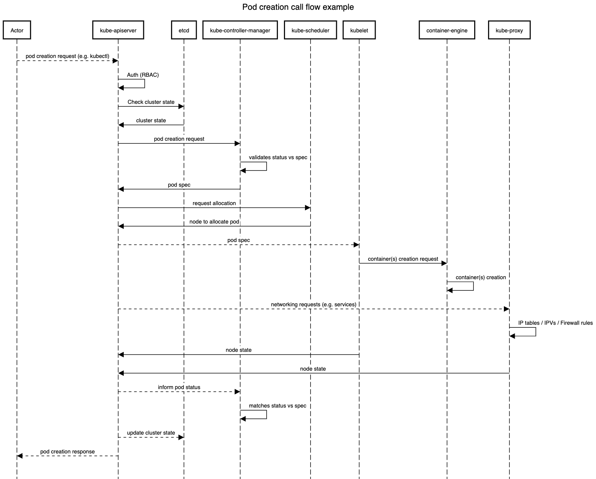

# Day 13 of #66DaysOfK8s

_Last update: 2021-01-24_

---

Today, I have worked in part 6 of a series of lessons in order to review the Kubernetes Architecture.
On this 6th day, a focus is on API Call Flow.

#kubernetes #learning #K8s #66DaysChallenge

---

## Versions used

* N/A (only theory)

---

## Setup

* N/A

---

## Tasks

Understand:

* API Call Flow

---

### API Call Flow

This is a basic explanation of the API Call Flow. There are many components not mentioned.
In this example, we are going to see how the API call flow in the case of a Pod creation request.

---

The flow goes as follows:

* An actor requests a pod creation (e.g. kubectl). An API call is sent to the kube-apiserver.
* The kube-apiserver handles authentication, authorization and admission controller.
* The kube-apiserver requests cluster state to etcd.
* The kube-apiserver requests a pod creation to kube-controller-manager.
* The kube-controller-manager looks at the current spec (via watch loops / operators) and compares it with the current status. If they don't match, then an operator adds (or removes) resources until they do.
* The kube-controller-manager requests a creation (or deletion) to kube-apiserver.
* The kube-apiserver requests a pod creation to kube-scheduler. The scheduler uses priorities or predicates to return which node the pod should go to.
* The kube-apiserver sent the request to the appropriate kubelet and kube-proxy.
* The kubelet requests the creation to the container-engine (typically Docker or cri-o).
* The kube-proxy handles networking such as the required services (also IP tables, IPVs or firewall rules).
* Then, both kubelet and kube-proxy inform back to kube-apiserver about the node state.
* Finally, kube-apiserver informs kube-controller-manager and the latter matches status vs spec (if applies).
