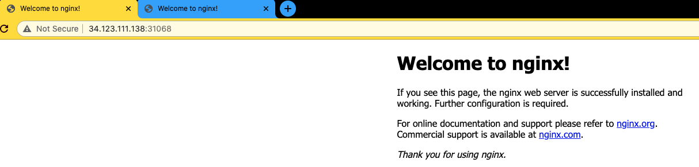
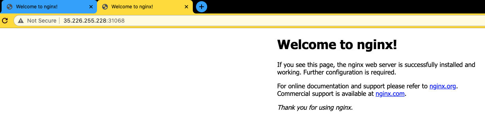

# Day 8 of #66DaysOfK8s

_Last update: 2021-01-18_

---

Today, I have worked in part 4 of a series of lessons in order to create a K8s cluster from scratch in GCP.
In this lesson I have deployed a simple app on the new cluster, and access from outside of it.

#kubernetes #learning #K8s #66DaysChallenge

---

## Versions used

* macOS Catalina 10.15.7
* Google Chrome 87.0.4280.88 (Official Build) (x86_64)
* Native macOS ssh client

---

## Setup

* Master node created ([part 1 link](../../week01/day5/README.md))
* K8s software running on the master node ([part 2 link](../../week01/day6/README.md))
* K8s software running on the worker node ([part 3 link](../../week01/day7/README.md))
* _Savings tip_: You can stop VM instances if you're not using them.
* If you, like me, have had issues connecting to the VM instances via SSH (after stop and start them regularly), there is a workaround ([check this link](../../workarounds.md)).

---

## Tasks

* Deploy a simple application, a nginx web server
* Access the application from outside the cluster

---

### Deploy a simple application, a nginx web server

Using the SSK keys obtained in previous parts, connect via ssh to the GCP VM instance associated with the **master** node:

```bash
# 1.2.3.4: replace with your own master node public IP
$ ssh -i "K8sPK1" student@1.2.3.4
The authenticity of host '1.2.3.4 (1.2.3.4)' can't be established.
ECDSA key fingerprint is SHA256:aknddjkj2ndbj213ndb23bndoi2ndbnjx.
Are you sure you want to continue connecting (yes/no/[fingerprint])? yes
Warning: Permanently added '1.2.3.4' (ECDSA) to the list of known hosts.

...

Last login: Fri Jan 15 11:46:26 2021 from 1.2.3.4
student@master:~$
```

---

Create a new deployment. Verify the desired number of containers matches the available ones.

```bash
student@master:~$ kubectl create deployment nginx --image=nginx
deployment.apps/nginx created
```

```bash
student@master:~$ kubectl get deployments
NAME    READY   UP-TO-DATE   AVAILABLE   AGE
nginx   1/1     1            1           21s
```

---

View the details of the deployment.

```bash
student@master:~$ kubectl describe deployment nginx
Name:                   nginx
Namespace:              default
CreationTimestamp:      Mon, 18 Jan 2021 22:16:28 +0000
Labels:                 app=nginx
Annotations:            deployment.kubernetes.io/revision: 1
Selector:               app=nginx
Replicas:               1 desired | 1 updated | 1 total | 1 available | 0 unavailable
StrategyType:           RollingUpdate
MinReadySeconds:        0
RollingUpdateStrategy:  25% max unavailable, 25% max surge
Pod Template:
  Labels:  app=nginx
  Containers:
   nginx:
    Image:        nginx
    Port:         <none>
    Host Port:    <none>
    Environment:  <none>
    Mounts:       <none>
  Volumes:        <none>
Conditions:
  Type           Status  Reason
  ----           ------  ------
  Available      True    MinimumReplicasAvailable
  Progressing    True    NewReplicaSetAvailable
OldReplicaSets:  <none>
NewReplicaSet:   nginx-f89759699 (1/1 replicas created)
Events:
  Type    Reason             Age   From                   Message
  ----    ------             ----  ----                   -------
  Normal  ScalingReplicaSet  48s   deployment-controller  Scaled up replica set nginx-f89759699 to 1
```

View the events about pull and deploy of the new application.

```bash
student@master:~$ kubectl get events | grep nginx
2m55s       Normal    Scheduled                 pod/nginx-f89759699-wnl4m    Successfully assigned default/nginx-f89759699-wnl4m to worker
2m54s       Normal    Pulling                   pod/nginx-f89759699-wnl4m    Pulling image "nginx"
2m50s       Normal    Pulled                    pod/nginx-f89759699-wnl4m    Successfully pulled image "nginx"
2m49s       Normal    Created                   pod/nginx-f89759699-wnl4m    Created container nginx
2m49s       Normal    Started                   pod/nginx-f89759699-wnl4m    Started container nginx
2m55s       Normal    SuccessfulCreate          replicaset/nginx-f89759699   Created pod: nginx-f89759699-wnl4m
2m56s       Normal    ScalingReplicaSet         deployment/nginx             Scaled up replica set nginx-f89759699 to 1
```

---

The deployment output could also be viewed in ```yaml``` format

```bash
student@master:~$ kubectl get deployment nginx -o yaml
```

> _Complete content is available in [this file](./originalDeployment.yaml)_.
```yaml
apiVersion: apps/v1
kind: Deployment
metadata:
  annotations:
    deployment.kubernetes.io/revision: "1"
# Output omitted
```

---

**Redirect the output to a yaml file**. Edit the file. Remove/Comment the ```creationTimestamp```, ```resourceVersion```, ```selfLink```, and ```uid``` lines. Remove/Comment also all the lines including and after ```status:```. **This step is required in order to avoid conflicts in new deployments**.

```bash
student@master:~$ kubectl get deployment nginx -o yaml > myDeployment.yaml
```

```bash
student@master:~$ vim myDeployment.yaml
# Remove the lines...
```

> _You will end up with a [file like this one](./myDeployment.yaml)_

---

Delete the existing deployment

```bash
student@master:~$ kubectl delete deployment nginx
deployment.apps "nginx" deleted
```

Create a new deployment based on the ```myDeployment.yaml``` file.

```bash
student@master:~$ kubectl create -f myDeployment.yaml
deployment.apps/nginx created
```

---

Compare the new deployment to the original one.

```bash
student@master:~$ kubectl get deployment nginx -o yaml > myNewDeployment.yaml
```

```bash
student@master:~$ diff myDeployment.yaml myNewDeployment.yaml
```

> _You will notice that ```creationTimestamp```, ```resourceVersion``` and ```uid``` are in the new file_

---

Now, use the ```--dry-run``` option. **It won't create the object (deployment)**, and it will have a different output (for instance, the ```apiVersion```).

```bash
student@master:~$ kubectl create deployment secondNginx --image=nginx --dry-run=client -o 
```

```yaml
apiVersion: apps/v1
kind: Deployment
metadata:
  creationTimestamp: null
  labels:
    app: secondNginx
  name: secondNginx
spec:
  replicas: 1
  selector:
    matchLabels:
      app: secondNginx
  strategy: {}
  template:
    metadata:
      creationTimestamp: null
      labels:
        app: secondNginx
    spec:
      containers:
      - image: nginx
        name: nginx
        resources: {}
status: {}
```

```bash
# Only the original deployment will be shown
student@master:~$ kubectl get deployments
NAME    READY   UP-TO-DATE   AVAILABLE   AGE
nginx   1/1     1            1           6m31s
```

---

K8s objects can also be viewed in ```json``` format.

```bash
student@master:~$ kubectl get deployments nginx -o json
{
    "apiVersion": "apps/v1",
    "kind": "Deployment",
    "metadata": {
        "annotations": {
            "deployment.kubernetes.io/revision": "1"
        },
        "creationTimestamp": "2021-01-18T22:32:01Z",
        "generation": 1,
        "labels": {
            "app": "nginx"
        },
# Output omitted
```

---

Nginx container is a light web server. In order to view the default web page, we have to create a ```service```.

```bash
student@master:~$ kubectl expose deployment/nginx
error: couldn't find port via --port flag or introspection
See 'kubectl expose -h' for help and examples
```

Last command will fail because there is no port to expose. Edit ```myDeployment.yaml``` file and add the following:

```bash
student@master:~$ cp myDeployment.yaml myExposedDeployment.yaml
```

```bash
student@master:~$ vim myExposedDeployment.yaml
```

```yaml
    spec:
      containers:
      - image: nginx
        imagePullPolicy: Always
        name: nginx
        ports:              # New lines
        - containerPort: 80 # New lines
          protocol: TCP     # New lines
        resources: {}
```

Save the file and apply the new configuration.

```bash
student@master:~$ kubectl replace -f myExposedDeployment.yaml
deployment.apps/nginx replaced
```

---

Now the expose will work.

```bash
student@master:~$ kubectl expose deployment/nginx
service/nginx exposed
```

---

Take note of the IPs in the following commands.

```bash
student@master:~$ kubectl get svc nginx
NAME    TYPE        CLUSTER-IP      EXTERNAL-IP   PORT(S)   AGE
nginx   ClusterIP   10.108.19.155   <none>        80/TCP    39s
```

```bash
student@master:~$ kubectl get ep nginx
NAME    ENDPOINTS           AGE
nginx   192.168.171.67:80   45s
```

Check the traffic on the node where the container is running.
> _In this case, it is the ```worker``` node_

```bash
# Only 1 pod should be running (items[0])
student@master:~$ kubectl describe pod $(kubectl get pods -l "app=nginx"  -o jsonpath='{.items[0].metadata.name}') | grep Node
Node:         worker/10.2.0.5
Node-Selectors:  <none>
```

Log in on that node and use ```tcpdump``` to catch the traffic while you access nginx webserver.

```bash
student@worker:~$ sudo tcpdump -i tunl0
tcpdump: verbose output suppressed, use -v or -vv for full protocol decode
listening on tunl0, link-type RAW (Raw IP), capture size 262144 bytes
```

---

While you keep your last command running, try to access the cluster on port 80, either with the IPs obtained from "```kubectl get svc nginx```" or "```kubectl get ep nginx```".

```bash
# kubectl get svc nginx -o jsonpath='{.spec.clusterIP}'
student@master:~$ curl 10.108.19.155:80
<!DOCTYPE html>
<html>
<head>
<title>Welcome to nginx!</title>
# Output omitted
```

On the worker node (or where the pod is running) you will see something like (```sudo tcpdump -i tunl0```)

```bash
22:59:38.875309 IP 192.168.219.64.58837 > 192.168.171.67.http: Flags [S], seq 1981021108, win 65320, options [mss 1420,sackOK,TS val 3102428592 ecr 0,nop,wscale 7], length 0
22:59:38.875688 IP 192.168.171.67.http > 192.168.219.64.58837: Flags [S.], seq 4110960719, ack 1981021109, win 65236, options [mss 1400,sackOK,TS val 1687563838 ecr 3102428592,nop,wscale 7], length 0
```

```bash
# kubectl get ep nginx -o jsonpath='{.subsets[0].addresses[0].ip}'
student@master:~$ curl 192.168.171.67:80
<!DOCTYPE html>
<html>
<head>
<title>Welcome to nginx!</title>
# Output omitted
```

On the worker node (or where the pod is running) you will see something like (```sudo tcpdump -i tunl0```)

```bash
23:05:22.012987 IP 192.168.219.64.48698 > 192.168.171.67.http: Flags [S], seq 2685670476, win 64400, options [mss 1400,sackOK,TS val 1014875463 ecr 0,nop,wscale 7], length 0
23:05:22.013342 IP 192.168.171.67.http > 192.168.219.64.48698: Flags [S.], seq 1277096769, ack 2685670477, win 65236, options [mss 1400,sackOK,TS val 1687906976 ecr 1014875463,nop,wscale 7], length 0
```

---

Now, scale up the deployment from 1 to 3 web servers

```bash
student@master:~$ kubectl scale deployment nginx --replicas=3
deployment.apps/nginx scaled
```

```bash
student@master:~$ kubectl get deploy nginx
NAME    READY   UP-TO-DATE   AVAILABLE   AGE
nginx   3/3     3            3           47m
```

Now the endpoints should be 3.

```bash
student@master:~$ kubectl get ep nginx
NAME    ENDPOINTS                                               AGE
nginx   192.168.171.67:80,192.168.171.68:80,192.168.219.86:80   29m
```

---

Note also that not necessarily all the new pods run on the same node. In this case, 2 of them on the worker node and 1 on the master one.

```bash
student@master:~$ kubectl describe pod $(kubectl get pods -l "app=nginx"  -o jsonpath='{.items[0].metadata.name}') | grep Node
Node:         master/10.2.0.3
Node-Selectors:  <none>
```

```bash
student@master:~$ kubectl describe pod $(kubectl get pods -l "app=nginx"  -o jsonpath='{.items[1].metadata.name}') | grep Node
Node:         worker/10.2.0.5
Node-Selectors:  <none>
```

```bash
student@master:~$ kubectl describe pod $(kubectl get pods -l "app=nginx"  -o jsonpath='{.items[2].metadata.name}') | grep Node
Node:         worker/10.2.0.5
Node-Selectors:  <none>
```

A faster way to see in which node runs a pod is with the following command:

```bash
student@master:~$ kubectl get pods -o wide
NAME                    READY   STATUS    RESTARTS   AGE     IP               NODE     NOMINATED NODE   READINESS GATES
nginx-d46f5678b-9xkqw   1/1     Running   0          7m39s   192.168.219.86   master   <none>           <none>
nginx-d46f5678b-dtprn   1/1     Running   0          36m     192.168.171.67   worker   <none>           <none>
nginx-d46f5678b-pbxd6   1/1     Running   0          7m39s   192.168.171.68   worker   <none>           <none>
```

---

Delete the oldest pod. _In this case, the first one_ (```nginx-d46f5678b-dtprn```) of the list based on the following command:

```bash
student@master:~$ kubectl get pods --sort-by=.metadata.creationTimestamp
NAME                    READY   STATUS    RESTARTS   AGE
nginx-d46f5678b-dtprn   1/1     Running   0          39m
nginx-d46f5678b-9xkqw   1/1     Running   0          10m
nginx-d46f5678b-pbxd6   1/1     Running   0          10m
```

```bash
student@master:~$ kubectl delete pod nginx-d46f5678b-dtprn
pod "nginx-d46f5678b-dtprn" deleted
```

Wait a moment, and a new pod will run. _In this case, the last one_ of the list (```nginx-d46f5678b-w2m2z```).

```bash
student@master:~$ kubectl get pods --sort-by=.metadata.creationTimestamp
NAME                    READY   STATUS    RESTARTS   AGE
nginx-d46f5678b-9xkqw   1/1     Running   0          13m
nginx-d46f5678b-pbxd6   1/1     Running   0          13m
nginx-d46f5678b-w2m2z   1/1     Running   0          13s
```

---

View the endpoints again. The original endpoint IP is no longer in use (```192.168.171.67``` in this example), however the service will balance the traffic among the available pods.

```bash
student@master:~$ kubectl get ep nginx
NAME    ENDPOINTS                                               AGE
nginx   192.168.171.68:80,192.168.171.69:80,192.168.219.86:80   42m
```

Try to access the webserver with the cluster IP address. It should work regardless of the endpoints behind it.

```bash
student@master:~$ export CLUSTER_IP=$(kubectl get svc nginx -o jsonpath='{.spec.clusterIP}')
```

```bash
student@master:~$ curl 192.168.171.67:80
<!DOCTYPE html>
<html>
<head>
<title>Welcome to nginx!</title>
# Output omitted
```

> You can end the ```tcpdump``` monitoring by hitting ```ctrl-c```.

---

### Access the application from outside the cluster

Delete the service nginx

```bash
student@master:~$ kubectl delete svc nginx
service "nginx" deleted
```

Create the service again, but now with ```LoadBalancer``` as its type.

```bash
student@master:~$ kubectl expose deployment nginx --type=LoadBalancer
service/nginx exposed
```

Unless a cloud providers responds with a load balancer it will continue to show as ```pending```.
If you are running this lab in GCP or AWS, use the public IP of either the master instance or the worker one in the node port described below (_in this case: 31068_)

```bash
student@master:~$ kubectl get svc nginx
NAME         TYPE           CLUSTER-IP       EXTERNAL-IP   PORT(S)        AGE
kubernetes   ClusterIP      10.96.0.1        <none>        443/TCP        2d
nginx        LoadBalancer   10.108.131.158   <pending>     80:31068/TCP   2s
```






---

If you scale the deployment to zero replicas, the web page access will fail.

```bash
student@master:~$ kubectl scale deployment nginx --replicas=0
deployment.apps/nginx scaled
```

---

### Cleanup

```bash
student@master:~$ kubectl delete deployments nginx
deployment.apps "nginx" deleted
```

```bash
student@master:~$ kubectl delete ep nginx
endpoints "nginx" deleted
```

```bash
student@master:~$ kubectl delete svc nginx
service "nginx" deleted
```
