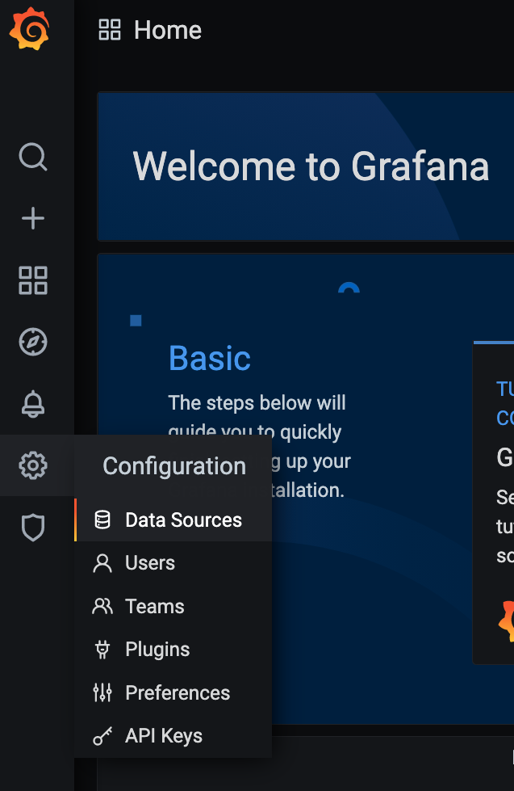
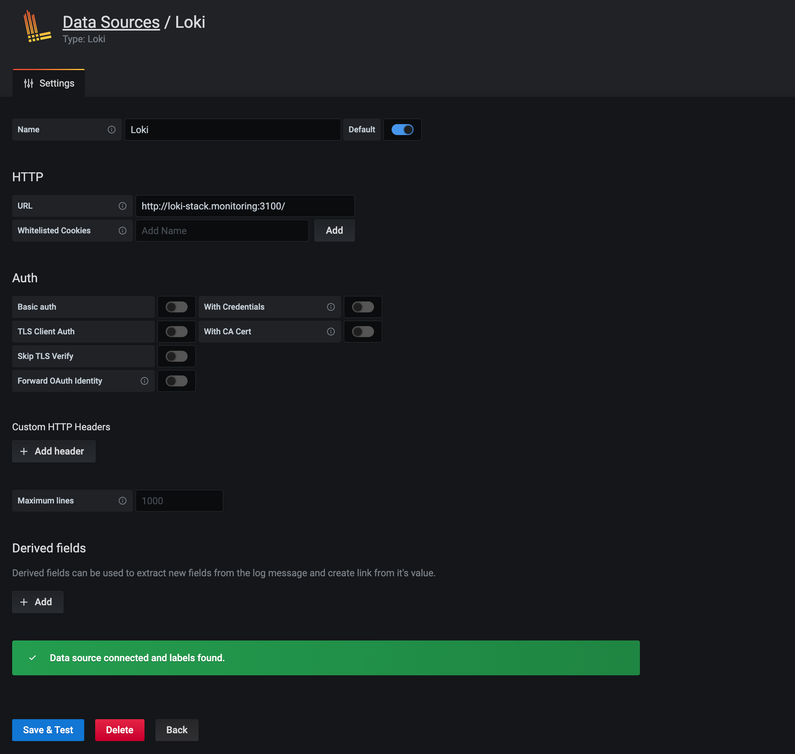
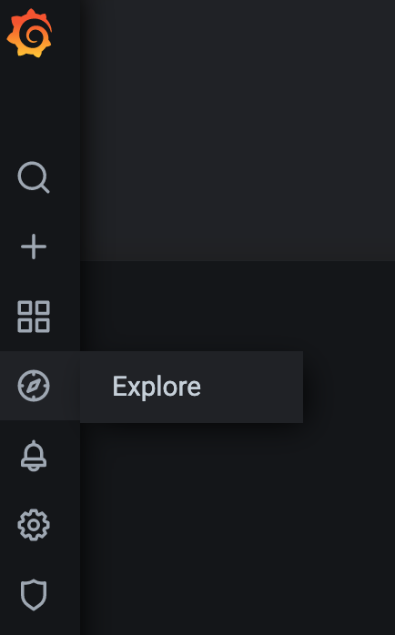
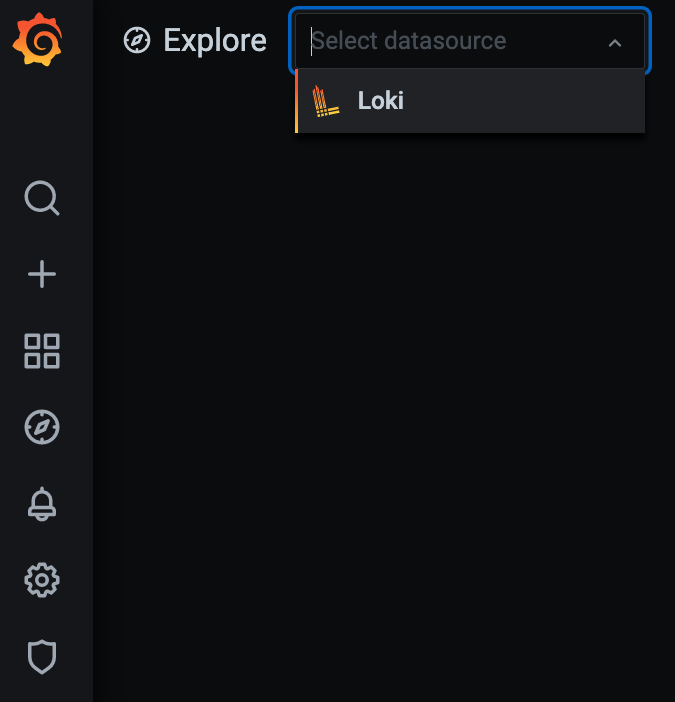
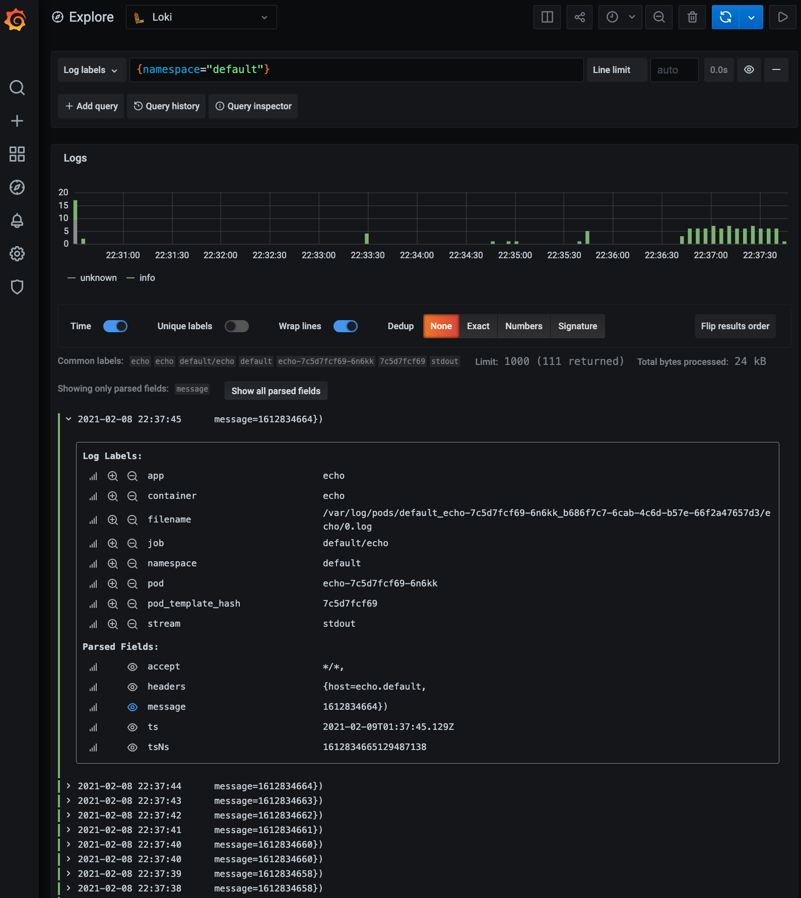

# Day 29 of #66DaysOfK8s

_Last update: 2021-02-08_

---

Today, continuing with Daemon sets, I have worked with Promtail which is conveniently embedded in Loki stack.

Also, in order to see logs, a simple Grafana deployment is done.

#kubernetes #learning #K8s #66DaysChallenge

---

## TL;DR

Loki (by Grafana) provides a simple and fully featured logging stack. You can visualize those logs with tools like Grafana.

---

## Versions used

* macOS Catalina 10.15.7
* Google Chrome 87.0.4280.88 (Official Build) (x86_64)
* Native macOS ssh client
* Helm v3.2.4

---

## Tasks

* Deploy Loki
* Deploy Grafana
* Add Loki as a data source in Grafana

---

### Deploy Loki

A convenient way to install Loki is with [Helm](https://helm.sh/docs/intro/install/). A recommended chart is Grafana's official repo.

```bash
$ helm repo add grafana https://grafana.github.io/helm-charts
"grafana" has been added to your repositories
```

Let's create a namespace to isolate all the stack.

$ kubectl create ns monitoring
namespace/monitoring created

---

We'll be installing Promtail and Loki, with a persistence size for Loki storage and a log retention period of 1 week.

A daemon set for Promtail is deployed; minikube is used, so there is only one instance.

```bash
export LOKI_PERSISTENCE_SIZE=10Gi
export LOGS_RETENTION_PERIOD=168h
export LOKI_HELM_RELEASE_NAME=loki-stack
```

```bash
$ helm -n monitoring install ${LOKI_HELM_RELEASE_NAME} grafana/loki-stack --set promtail.enabled=true,loki.persistence.enabled=true,loki.persistence.size=${LOKI_PERSISTENCE_SIZE},config.table_manager.retention_deletes_enabled=true,config.table_manager.retention_period=${LOGS_RETENTION_PERIOD}

NAME: loki-stack
LAST DEPLOYED: Mon Feb  8 22:07:00 2021
NAMESPACE: monitoring
STATUS: deployed
REVISION: 1
NOTES:
The Loki stack has been deployed to your cluster. Loki can now be added as a datasource in Grafana.

See http://docs.grafana.org/features/datasources/loki/ for more detail.
```

---

```bash
$ kubectl -n monitoring get svc,deploy,rs,pv,pvc,pod,ds

NAME                          TYPE        CLUSTER-IP      EXTERNAL-IP   PORT(S)    AGE
service/loki-stack            ClusterIP   10.100.53.241   <none>        3100/TCP   39s
service/loki-stack-headless   ClusterIP   None            <none>        3100/TCP   39s

NAME                                                        CAPACITY   ACCESS MODES   RECLAIM POLICY   STATUS   CLAIM
 STORAGECLASS   REASON   AGE
persistentvolume/pvc-46014675-79b2-4e78-bb8d-a3b7a666478b   10Gi       RWO            Delete           Bound    monitoring/storage-loki-stack-0
 standard                38s

NAME                                         STATUS   VOLUME                                     CAPACITY   ACCESS MODES   STORAGECLASS   AGE
persistentvolumeclaim/storage-loki-stack-0   Bound    pvc-46014675-79b2-4e78-bb8d-a3b7a666478b   10Gi       RWO            standard       39s

NAME                            READY   STATUS    RESTARTS   AGE
pod/loki-stack-0                0/1     Running   0          39s
pod/loki-stack-promtail-5pcmm   1/1     Running   0          39s

NAME                                 DESIRED   CURRENT   READY   UP-TO-DATE   AVAILABLE   NODE SELECTOR   AGE
daemonset.apps/loki-stack-promtail   1         1         1       1            1           <none>          39s
```

---

### Deploy Grafana

```bash
$ export GRAFANA_PERSISTENCE_SIZE=10Gi
export GRAFANA_HELM_RELEASE_NAME=loki-grafana
```

```bash
$ helm -n monitoring install ${GRAFANA_HELM_RELEASE_NAME} grafana/grafana --set persistence.enabled=true,persistence.type=pvc,persistence.size=${GRAFANA_PERSISTENCE_SIZE}

NAME: loki-grafana
#Output omitted
NOTES:
1. Get your 'admin' user password by running:

   kubectl get secret --namespace monitoring loki-grafana -o jsonpath="{.data.admin-password}" | base64 --decode ; echo

2. The Grafana server can be accessed via port 80 on the following DNS name from within your cluster:

   loki-grafana.monitoring.svc.cluster.local

   Get the Grafana URL to visit by running these commands in the same shell:

     export GRAFANA_POD_NAME=$(kubectl get pods --namespace monitoring -l "app.kubernetes.io/name=grafana,app.kubernetes.io/instance=loki-grafana" -o jsonpath="{.items[0].metadata.name}")

     kubectl --namespace monitoring port-forward $GRAFANA_POD_NAME 3000

3. Login with the password from step 1 and the username: admin
Access Grafana Dashboard:

$ export GRAFANA_ADMIN_PASSWORD=$(kubectl get secret --namespace monitoring loki-grafana -o jsonpath="{.data.admin-password}" | base64 --decode)
$ kubectl -n monitoring port-forward service/loki-grafana 3000:80
Open http://localhost:3000.

Login: admin
```

---

```bash
$ kubectl -n monitoring get svc,deploy,rs,pv,pvc,pod,ds

NAME                          TYPE        CLUSTER-IP      EXTERNAL-IP   PORT(S)    AGE
service/loki-grafana          ClusterIP   10.109.236.10   <none>        80/TCP     87s
service/loki-stack            ClusterIP   10.100.53.241   <none>        3100/TCP   3m23s
service/loki-stack-headless   ClusterIP   None            <none>        3100/TCP   3m23s

NAME                           READY   UP-TO-DATE   AVAILABLE   AGE
deployment.apps/loki-grafana   1/1     1            1           87s

NAME                                     DESIRED   CURRENT   READY   AGE
replicaset.apps/loki-grafana-bb849cdd8   1         1         1       87s

NAME                                                        CAPACITY   ACCESS MODES   RECLAIM POLICY   STATUS   CLAIM
 STORAGECLASS   REASON   AGE
persistentvolume/pvc-46014675-79b2-4e78-bb8d-a3b7a666478b   10Gi       RWO            Delete           Bound    monitoring/storage-loki-stack-0
 standard                3m22s
persistentvolume/pvc-8aa0bb36-6e4c-4ea8-ac07-98cbfebd7720   10Gi       RWO            Delete           Bound    monitoring/loki-grafana
 standard                87s

NAME                                         STATUS   VOLUME                                     CAPACITY   ACCESS MODES   STORAGECLASS   AGE
persistentvolumeclaim/loki-grafana           Bound    pvc-8aa0bb36-6e4c-4ea8-ac07-98cbfebd7720   10Gi       RWO            standard       87s
persistentvolumeclaim/storage-loki-stack-0   Bound    pvc-46014675-79b2-4e78-bb8d-a3b7a666478b   10Gi       RWO            standard       3m23s

NAME                               READY   STATUS    RESTARTS   AGE
pod/loki-grafana-bb849cdd8-679ch   1/1     Running   0          87s
pod/loki-stack-0                   1/1     Running   0          3m23s
pod/loki-stack-promtail-5pcmm      1/1     Running   0          3m23s

NAME                                 DESIRED   CURRENT   READY   UP-TO-DATE   AVAILABLE   NODE SELECTOR   AGE
daemonset.apps/loki-stack-promtail   1         1         1       1            1           <none>          3m23s
```

---

### Add Loki as a data source in Grafana

Run Grafana.

```bash
export GRAFANA_POD_NAME=$(kubectl get pods --namespace monitoring -l "app.kubernetes.io/name=grafana,app.kubernetes.io/instance=loki-grafana" -o jsonpath="{.items[0].metadata.name}")

kubectl --namespace monitoring port-forward $GRAFANA_POD_NAME 3000
```

Open [http://localhost:3000](http://localhost:3000), with ``admin``` as the username. Its password can be retrieved from the generated secret.

```bash
export GRAFANA_ADMIN_PASSWORD=$(kubectl get secret --namespace monitoring loki-grafana -o jsonpath="{.data.admin-password}" | base64 --decode)

echo $GRAFANA_ADMIN_PASSWORD
```

---

Once in Grafana Homepage, go to Configuration and then to Data Sources. Then, click on "Add data source", select "Loki" and finally set ```http://loki-stack.monitoring:3100/``` as the URL.





Go to Explore icon and select "Loki" in the Data source combo box.





---

Generate sample logs with an echo simple app.

```bash
kubectl -n default run --generator=run-pod/v1 tester --image=nectiadocker2000/podtesterspring:v2
```

```bash
$ kubectl -n default apply -f yaml/.
deployment.apps "echo" created
service "echo" created
```

Keep the following cycle running while you see logs in Grafana.

```bash
while true; do kubectl -n default exec -ti pod/tester -c tester -- curl http://echo.default -H "message: $(date +%s)"; sleep .5; done
```

---

Go back to Grafana and you will be able to watch generated logs. You can play with many filters and visualization options from Grafana.



---

### Cleanup

```bash
$ kubectl delete -f yaml/.
deployment.apps "echo" deleted
service "echo" deleted
```

```bash
$ kubectl delete pod tester
pod "tester" deleted
```

```bash
$ helm -n monitoring uninstall loki-grafana
release "loki-grafana" uninstalled
```

```bash
$ helm -n monitoring uninstall loki-stack
release "loki-stack" uninstalled
```

---

## References

* [Grafana Loki (official site)](https://grafana.com/docs/loki/latest/)

* [Grafana Helm charts (official site)](https://github.com/grafana/helm-charts)
