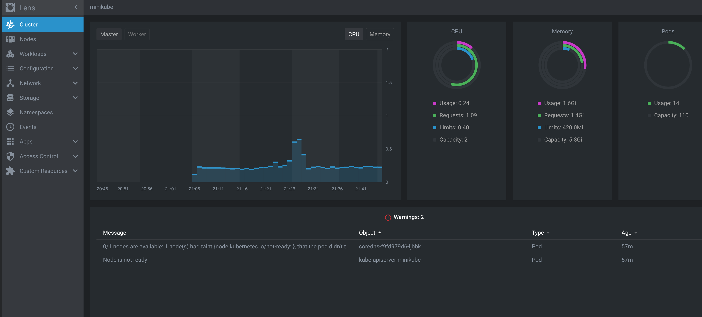
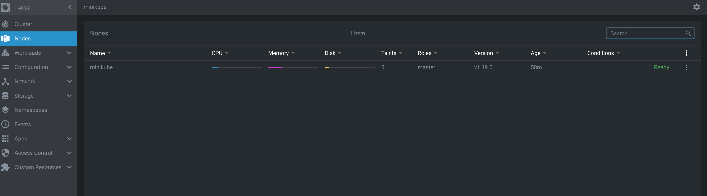
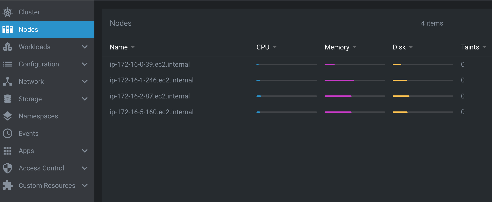
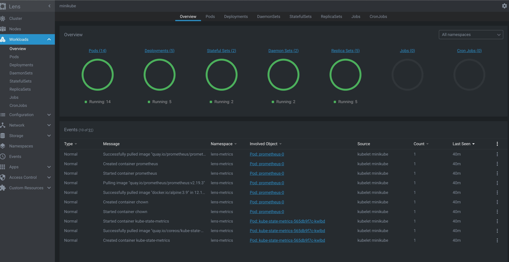

# Day 42 of #66DaysOfK8s

_Last update: 2021-02-21_

---
Today, I have worked with [lens](https://k8slens.dev/), a convenient open source software to monitor your K8s resources.

#kubernetes #learning #K8s #66DaysChallenge

---

## TL;DR

Lens is an easy-to-use application that allows you to quickly access your K8s resources and their stats. You can manage several clusters within the same app just by configuring their kubeconfig file.

It also provides a handy built-in Prometheus Stack app to access useful resource utilization information.

---

## Versions used

* macOS Catalina 10.15.7
* minikube: v1.13.0
* kubectl Client: v1.17.4
* kubectl Server: v1.19.0
* lens: 4.1.2

---

## Setup

I have installed the .dmg file in this [link](https://github.com/lensapp/lens/releases/tag/v4.1.2).

---

## Configuration

Once installed, you have to add clusters. Every cluster requires a kubeconfig file, either as a file or paste its context as text. You can also select a context if you have a kubeconfig with multiple contexts.

To do it, just click on the ```+``` icon at the top left.

---

## Install metrics

If you don't have cluster metrics installed such as Prometheus, lens offers a built-in Prometheus app that you can simply install as a Helm application. To do it, go to Settings (top right icon) and then go to the end and find "Features / Metrics Stack".

The stack is available in this [link](https://github.com/lensapp/lens/tree/master/extensions/metrics-cluster-feature/resources). All its resources will be deployed in a new namespace called ```lens-metrics```.

---

## Usage

You can quickly view your K8s resources with ease. The Apps icon refers to applications deployed as a Helm release.










---

## References

* [Lens Homepage](https://k8slens.dev/)
