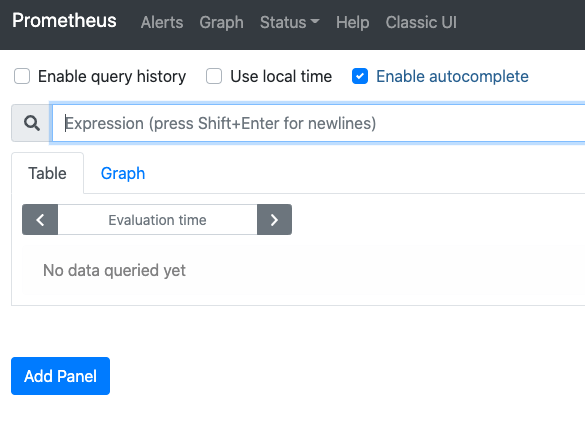
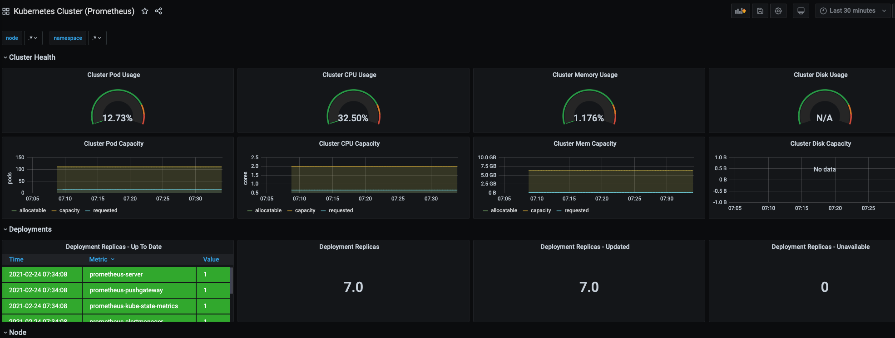
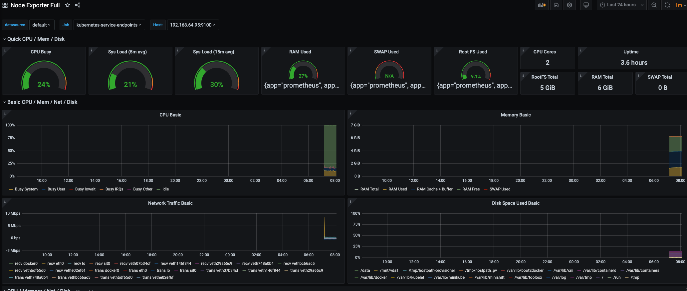
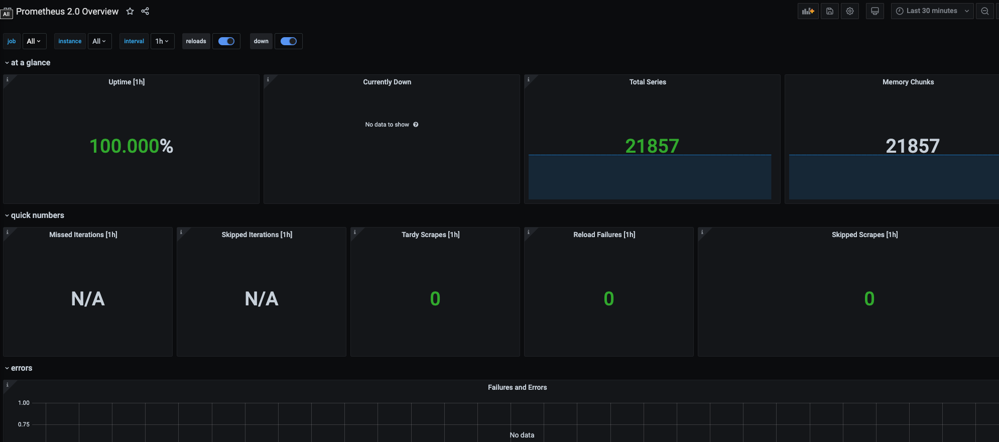

# Day 44 of #66DaysOfK8s

_Last update: 2021-02-23_

---
Today, I have worked with [Prometheus](https://landscape.cncf.io/?selected=prometheus) and [Grafana](https://landscape.cncf.io/?selected=grafana), both powerful applications for monitoring resources.

> _Based on: [Blog article by by Marc Nuri](https://blog.marcnuri.com/prometheus-grafana-setup-minikube/)_

#kubernetes #learning #K8s #66DaysChallenge

---

## Versions used

* macOS Catalina 10.15.7
* minikube: v1.13.0
* kubectl Client: v1.17.4
* kubectl Server: v1.19.0
* Helm: v3.2.4
* Community Helm version for [Prometheus](https://prometheus-community.github.io/helm-charts
) and [Grafana](https://grafana.github.io/helm-charts).

---

## Setup

I have installed community Helm versions for Prometheus and Grafana.

---

## Install Prometheus

Just deploy Prometheus using Helm. Stable channel has been deprecated in favor of the Community one.

```bash
$ helm repo add prometheus-community https://prometheus-community.github.io/helm-charts
"prometheus-community" has been added to your repositories
```

```bash
helm install prometheus prometheus-community/prometheus
# Output omitted
STATUS: deployed
REVISION: 1
TEST SUITE: None
NOTES:
The Prometheus server can be accessed via port 80 on the following DNS name from within your cluster:
prometheus-server.default.svc.cluster.local


Get the Prometheus server URL by running these commands in the same shell:
  export POD_NAME=$(kubectl get pods --namespace default -l "app=prometheus,component=server" -o jsonpath="{.items[0].metadata.name}")
  kubectl --namespace default port-forward $POD_NAME 9090


The Prometheus alertmanager can be accessed via port 80 on the following DNS name from within your cluster:
prometheus-alertmanager.default.svc.cluster.local


Get the Alertmanager URL by running these commands in the same shell:
  export POD_NAME=$(kubectl get pods --namespace default -l "app=prometheus,component=alertmanager" -o jsonpath="{.items[0].metadata.name}")
  kubectl --namespace default port-forward $POD_NAME 9093
#################################################################################
######   WARNING: Pod Security Policy has been moved to a global property.  #####
######            use .Values.podSecurityPolicy.enabled with pod-based      #####
######            annotations                                               #####
######            (e.g. .Values.nodeExporter.podSecurityPolicy.annotations) #####
#################################################################################


The Prometheus PushGateway can be accessed via port 9091 on the following DNS name from within your cluster:
prometheus-pushgateway.default.svc.cluster.local


Get the PushGateway URL by running these commands in the same shell:
  export POD_NAME=$(kubectl get pods --namespace default -l "app=prometheus,component=pushgateway" -o jsonpath="{.items[0].metadata.name}")
  kubectl --namespace default port-forward $POD_NAME 9091

For more information on running Prometheus, visit:
https://prometheus.io/
```

For accessing Prometheus Web Dashboard:

```bash
$ kubectl expose service prometheus-server --type=NodePort --target-port=9090 --name=prometheus-server-np
service/prometheus-server-np exposed
```

```bash
$ minikube service prometheus-server-np
|-----------|----------------------|-------------|----------------------------|
| NAMESPACE |         NAME         | TARGET PORT |            URL             |
|-----------|----------------------|-------------|----------------------------|
| default   | prometheus-server-np |          80 | http://192.168.64.95:31445 |
|-----------|----------------------|-------------|----------------------------|
```



---

## Configure Grafana

Install Grafana with Community Helm.

```bash
$ helm repo add grafana https://grafana.github.io/helm-charts
"grafana" has been added to your repositories
```

```bash
$ helm install grafana stable/grafana
# Output omitted
STATUS: deployed
REVISION: 1
NOTES:
*******************
****DEPRECATED*****
*******************
* The chart is deprecated. Future development has been moved to https://github.com/grafana/helm2-grafana

1. Get your 'admin' user password by running:

   kubectl get secret --namespace default grafana -o jsonpath="{.data.admin-password}" | base64 --decode ; echo

2. The Grafana server can be accessed via port 80 on the following DNS name from within your cluster:

   grafana.default.svc.cluster.local

   Get the Grafana URL to visit by running these commands in the same shell:

     export POD_NAME=$(kubectl get pods --namespace default -l "app.kubernetes.io/name=grafana,app.kubernetes.io/instance=grafana" -o jsonpath="{.items[0].metadata.name}")
     kubectl --namespace default port-forward $POD_NAME 3000

3. Login with the password from step 1 and the username: admin
#################################################################################
######   WARNING: Persistence is disabled!!! You will lose your data when   #####
######            the Grafana pod is terminated.                            #####
#################################################################################
```

```bash
$ kubectl expose service grafana --type=NodePort --target-port=3000 --name=grafana-np
service/grafana-np exposed
```

To access Grafana Web Dashboard use admin as the username and fetch the password from a K8s secret created by this deployment.

```bash
# Grafana Web Dasboard Password
$ kubectl get secret --namespace default grafana -o jsonpath="{.data.admin-password}" | base64 --decode ; echo
9TMD4seakVlVJqBkVSOGH65v9mbgROJvznFPrIqT # Sample
```

```bash
$ minikube service grafana-np
|-----------|------------|-------------|----------------------------|
| NAMESPACE |    NAME    | TARGET PORT |            URL             |
|-----------|------------|-------------|----------------------------|
| default   | grafana-np |          80 | http://192.168.64.95:30810 |
|-----------|------------|-------------|----------------------------|
```

---

## Add Dashboards to Grafana

First, configure Prometheus as a datasource in Grafana.

Go to Configuration > Datasources and add a new Prometheus instance. Prometheus URL is ```http://prometheus-server:80```.

Then, adding dashboard is very simple. There are many already created in the [Official and community built dashboards](https://grafana.com/grafana/dashboards).

Go to Create (+) > Import section to Import via grafana.com, and copy the Grafana.com dashboard Id and select Prometheus as its data source.

For example, I've added dashboards Ids 6417, 1860 and 3662.






